# Capstone System Documentation

## Project Title

**Web-Based Labor Productivity and Construction Progress Monitoring System**

Optional display name:

**BuildTrack: A Web-Based Labor Productivity and Construction Progress Monitoring System for Construction Projects**

## 1. System Overview

The system is a web-based construction monitoring application designed to help project owners, supervisors, site engineers, and QA/QC personnel track project progress and labor productivity. It focuses on three core questions:

- What projects are currently active?
- What construction work is planned under each project?
- How much work has actually been completed compared with the planned target?

The system allows authorized users to create projects, define task heads, create specific tasks, record actual completed work, monitor progress, view project schedules in a calendar, and review dashboard/report summaries. Each user can only view and manage the projects created under their own account.

## 2. Purpose of the System

The purpose of the system is to provide a centralized digital tool for monitoring construction project progress and labor productivity. Traditional project monitoring often depends on manual records, spreadsheets, and verbal updates, which can make it difficult to see delays, productivity issues, and overall project health in real time.

This system helps reduce manual tracking by automatically computing progress percentages, task head progress, project completion, and productivity output based on actual completed area, target area, worker count, output per hour, and work schedule.

## 3. General Objectives

The general objective of the system is to develop a web-based labor productivity and construction progress monitoring system that can help construction project teams record, monitor, and evaluate project progress using actual completed area and productivity-related data.

## 4. Specific Objectives

The system aims to:

1. Allow users to securely log in and access only their own project data.
2. Allow users to create, edit, view, and delete construction projects.
3. Allow users to organize work into task heads such as Structural and Architectural work packages.
4. Allow users to create specific tasks under each task head with target area, schedule, manpower, and productivity values.
5. Allow users to record weekly or monthly progress updates using actual completed area.
6. Automatically compute task, task head, and project progress.
7. Automatically compute productivity output based on workers, helpers, output per hour, and working time.
8. Display project status, delayed work, critical work, and labor productivity issues.
9. Provide a dashboard, calendar, and reports for project monitoring and decision-making.

## 5. Scope and Limitations

### Scope

The system includes the following features:

- User authentication and account-based project access
- Project management
- Task head management
- Specific task management
- Progress update recording
- Automatic progress computation
- Labor productivity output computation
- Dashboard summary
- Calendar schedule view
- Monthly report summary
- Status indicators for project and task monitoring
- Delete confirmation for projects, task heads, and tasks

### Limitations

The current system does not include:

- Offline mobile application
- Worker attendance tracking
- Cost estimation
- Photo upload or image documentation
- PDF export of reports
- Advanced predictive analytics
- Multi-company administration
- Real-time collaborative editing

These features may be added in future development.

## 6. Target Users

The intended users of the system are:

- Project owner
- Construction supervisor
- Site engineer
- QA/QC personnel
- Project monitoring staff
- Capstone evaluator or system administrator during testing

## 7. Technology Stack

| Layer | Technology |
| --- | --- |
| Frontend | Next.js, React, TypeScript |
| Styling | Tailwind CSS, shadcn-style UI components |
| Backend | Next.js Server Actions and server-side data handling |
| Database ORM | Prisma |
| Database | PostgreSQL |
| Authentication | Supabase authentication |
| Charts | Recharts |
| Calendar | FullCalendar |
| Validation | Zod, React Hook Form |
| Icons | Lucide React |
| Notifications | Sonner toast notifications |
| Deployment Target | Vercel or any Node.js-compatible hosting platform |

## 8. High-Level System Architecture

The system follows a three-layer web application architecture. Users interact with the Presentation Layer through a web browser. All user actions are handled by Server Actions in the Application Layer which performs validation, business logic, progress computation, and database operations. Data is persisted in PostgreSQL and accessed through Prisma ORM in the Data Layer. Supabase provides authentication as an external service.

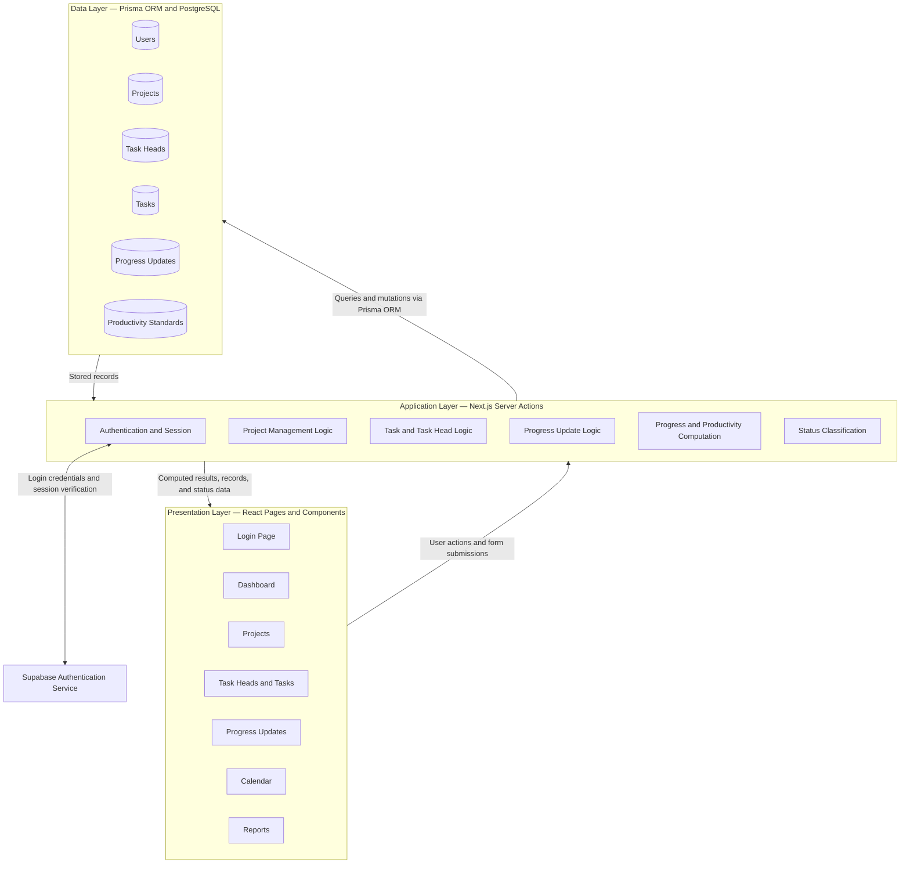

## 9. System Architecture Description

### Presentation Layer

The presentation layer contains the user interface pages and reusable UI components. It includes:

- Login page
- Dashboard page
- Projects page
- Project details page
- Task heads page
- Tasks page
- Progress updates page
- Calendar page
- Reports page
- Settings page

### Application Layer

The application layer handles user actions, validation, and business rules. It includes:

- Project creation and update logic
- Project deletion logic
- Task head creation and deletion logic
- Task creation, update, and deletion logic
- Progress update submission
- Progress rollup recalculation
- Productivity computation
- Status classification

### Data Layer

The data layer stores all persistent system data using PostgreSQL. Prisma is used as the ORM to map application models to database tables.

The main data entities are:

- Users
- Projects
- Task Heads
- Tasks
- Progress Updates
- Productivity Standards
- Reports

## 10. System Modules

### 10.1 Authentication Module

This module allows authorized users to log in using email and password. It protects project data by ensuring that each user can only access records created under their own account.

Main functions:

- User login
- User session checking
- Account-based data filtering
- Access validation before updates and deletion

### 10.2 Dashboard Module

The dashboard provides a quick overview of project performance. It displays project count, progress summaries, productivity issues, warnings, recent progress updates, and visual charts.

Main functions:

- Display total projects
- Display overall progress
- Show delayed, critical, or at-risk tasks
- Show labor productivity issues
- Show recent updates
- Display progress and productivity charts

### 10.3 Project Management Module

This module allows users to manage construction projects.

Main functions:

- Create project
- View project list
- Open project details
- Edit project details
- Delete project with confirmation

Project data includes:

- Project name
- Location
- Total target area
- Start date
- End date
- Status
- Created by

### 10.4 Task Head Management Module

Task heads represent major work packages under a project. Examples include Structural Works, Architectural Works, Masonry Works, and Finishing Works.

Main functions:

- Create task head
- View task heads under a project
- Delete task head with confirmation
- Compute task head progress based on specific tasks

### 10.5 Specific Task Management Module

Specific tasks represent the actual work items under a task head.

Main functions:

- Create task
- Edit task
- Delete task with confirmation
- Assign target area and unit
- Assign schedule
- Assign worker counts
- Assign output per hour and working time
- Compute expected productivity output

### 10.6 Progress Update Module

This module records actual completed work for a task.

Main functions:

- Select task
- Choose update type: Weekly or Monthly
- Enter date covered
- Enter actual completed area
- Enter updated by
- Add remarks
- Save update
- Recalculate task, task head, and project progress

### 10.7 Calendar Module

The calendar module displays scheduled tasks by date. It helps users identify active, upcoming, delayed, critical, completed, and on-track tasks.

Main functions:

- Display tasks in calendar format
- Show task schedule
- Show status using color or label
- Allow users to review task details

### 10.8 Reports Module

The reports module summarizes project health for progress meetings and monitoring.

Main functions:

- Display project report summaries
- Highlight delayed tasks
- Highlight critical tasks
- Highlight labor productivity issues
- Provide suggested actions

## 11. System Design

### 11.1 Input

The system accepts the following inputs:

- User login credentials
- Project details
- Task head details
- Task details
- Worker counts
- Helpers
- Output per hour
- Time in hours
- Weeks per month
- Days per month
- Actual completed area
- Task status
- Progress remarks

### 11.2 Process

The system processes the input through:

- Form validation
- Authentication and authorization checking
- Database record creation or update
- Progress percentage computation
- Productivity output computation
- Status rollup
- Dashboard and report generation

### 11.3 Output

The system produces the following outputs:

- Project list
- Project details
- Task head summaries
- Task progress cards
- Progress percentages
- Dashboard metrics
- Calendar schedule
- Report summaries
- Status warnings
- Productivity issue indicators

## 12. System Flow Chart

This flowchart shows the overall process flow from the moment a user opens the web application to the end of a working session. It covers the login process, project creation or selection, task head and task setup, progress recording, and how the system refreshes the dashboard, calendar, and reports after each update. The diagram also shows what happens when input is invalid, such as wrong login credentials or missing form data, so the user is guided back to correct the entry before proceeding.

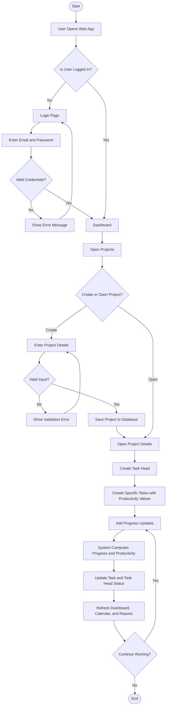

## 13. Progress Update Flow Chart

This flowchart details the step-by-step process of recording a progress update for a specific task. It shows how the user selects a task, chooses the update type, and enters the actual completed area. The system then validates the input, saves the progress update record, computes the task progress percentage, checks whether the progress should be capped at 100 percent, classifies the new task status, and rolls up the computed values to the task head and project level. The dashboard, calendar, and reports are refreshed automatically at the end of the process.

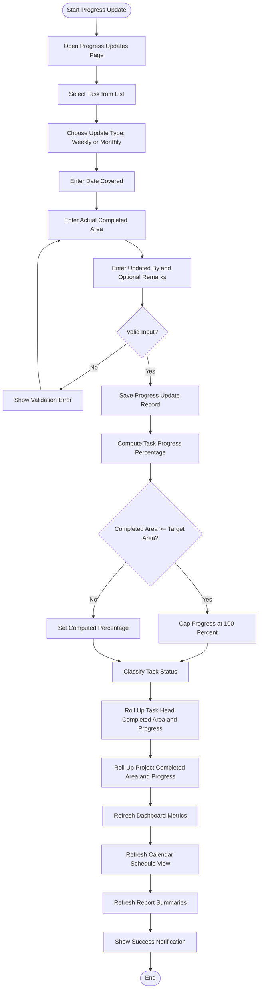

## 14. Project Deletion Flow Chart

This flowchart shows the complete deletion process for a project. Before any record is removed, the system requires the user to confirm the action through a confirmation modal. It then verifies that the user has an active session and that the project belongs to the current user. If either check fails, the process stops and an error is shown. If both checks pass, the system removes all related records in the correct order — progress updates first, then tasks, task heads, and reports — before finally deleting the project record. The project list and dashboard are refreshed afterward to reflect the change.

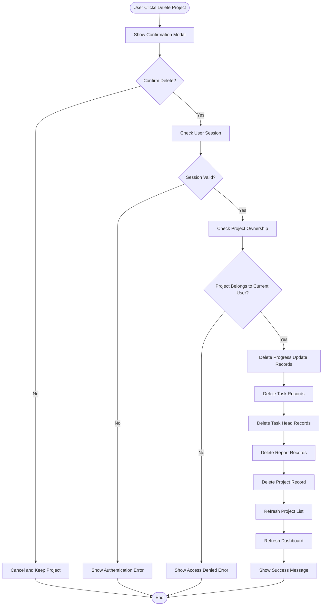

## 15. Data Flow Diagram

### Level 0 Context Diagram

The Level 0 Context Diagram presents the system as a single process and focuses on what goes in and what comes out. It identifies the two external entities that interact with the system: the User who provides project, task, and progress data, and the Database that stores and returns all records. This diagram establishes the boundary of the system and gives a high-level picture of the information exchange before going into more detail in Level 1.

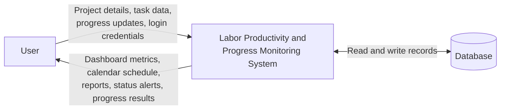

### Level 1 Data Flow Diagram

The Level 1 Data Flow Diagram breaks down the single process from Level 0 into the seven main processes inside the system. Each numbered process circle represents a system function. The cylinder shapes represent the six data stores where records are saved and retrieved. The labeled arrows show exactly what data moves between the user, the processes, and the data stores. This diagram makes it possible to trace where each piece of input data goes and how the system produces the outputs shown in the Level 0 diagram.

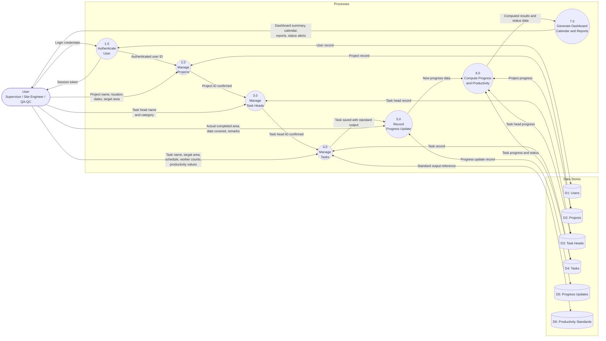

## 16. Use Case Diagram

The Use Case Diagram identifies all the actions that the system's users can perform. Each oval inside the system boundary represents a use case, which is a specific function the system provides. The actor outside the boundary represents the users who interact with the system. Dashed arrows labeled `<<include>>` indicate sub-processes that are automatically triggered whenever the parent use case is executed. For example, deleting a project always includes verifying user ownership and showing a confirmation dialog. This diagram gives evaluators a complete picture of the system's functional scope from the user's perspective.

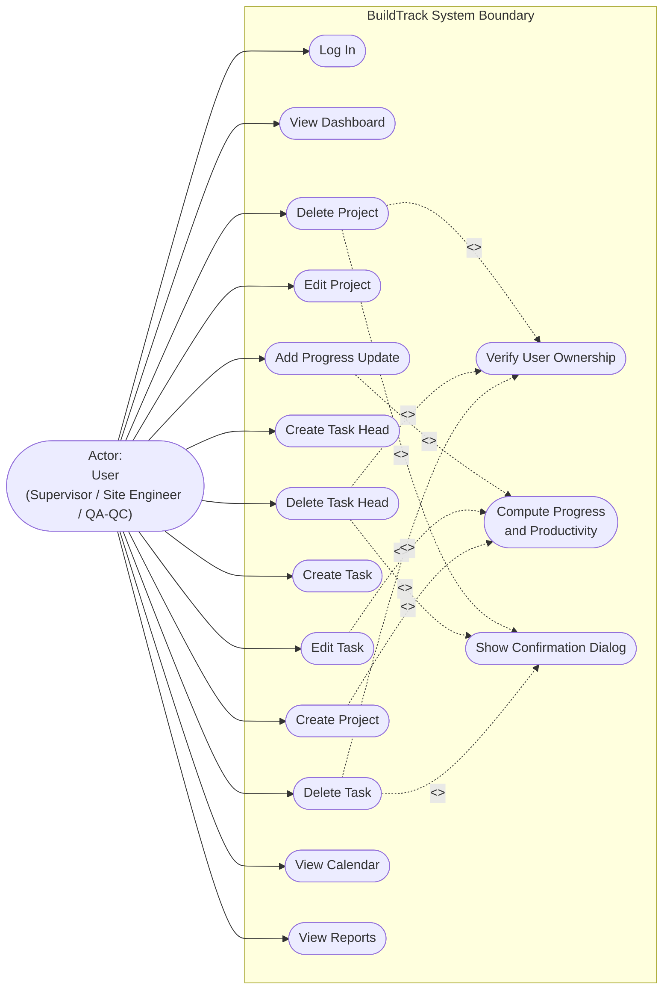

## 17. Entity Relationship Diagram

The Entity Relationship Diagram is a map that shows all the information the system needs to store and how each piece of information is connected to the others. Think of it like a set of filing folders — each box in the diagram is one folder (called an entity), and the lines between them show which folders are related to each other.

Each box lists the fields inside it, which are the specific details that get saved. For example, the PROJECT box holds the project name, location, start date, end date, and progress. The lines connecting the boxes show the relationship between them — for instance, one User can own many Projects, and one Project can contain many Task Heads. The small symbols at the end of each line (called crow's foot notation) indicate whether a connection is required or optional, and whether one record links to one other record or to many.

The `PRODUCTIVITY_STANDARD` box is a reference folder. Tasks can optionally look up a standard to automatically fill in expected productivity values instead of entering them manually every time.

### Understanding PK and FK

Each entity in the diagram lists its fields marked with either **PK** or **FK**. Here is what each one means in plain terms:

**PK — Primary Key**
A Primary Key is the unique ID of a record. Think of it like a student ID number in a school — no two students share the same ID, so the school can always tell exactly which student a record belongs to. In this system, every project, task, task head, and progress update has its own PK so the database can find and manage each record individually without confusion.

**FK — Foreign Key**
A Foreign Key is a field that points to the Primary Key of a record in another table. Think of it like writing a student's ID number on their exam paper — the exam paper itself does not hold all the student's information, but the ID written on it tells you exactly which student it belongs to. In this system, for example, every Task record has a `task_head_id` FK that tells the database which Task Head the task belongs to. This is how the database knows which records are connected to each other without storing duplicate information.

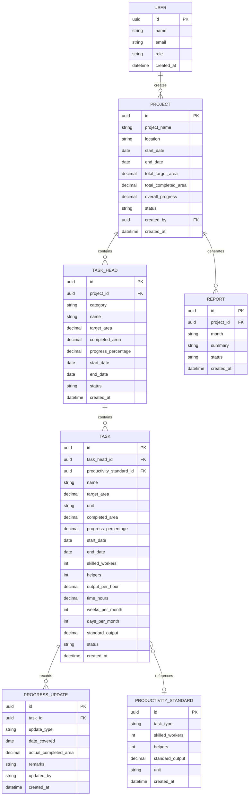

## 18. Database Design

### users

Stores user profile information.

| Field | Type | Description |
| --- | --- | --- |
| id | UUID | Unique user ID (primary key) |
| name | String | Name of user |
| email | String | Unique email address |
| role | String | User role |
| created_at | DateTime | Date and time created |

### projects

Stores construction project information.

| Field | Type | Description |
| --- | --- | --- |
| id | UUID | Unique project ID (primary key) |
| project_name | String | Name of project |
| location | String | Project location |
| start_date | Date | Project start date |
| end_date | Date | Project end date |
| total_target_area | Decimal | Fixed baseline project area |
| total_completed_area | Decimal | Computed completed area |
| overall_progress | Decimal | Computed project progress percentage |
| status | String | Project status |
| created_by | UUID | Foreign key to users table |
| created_at | DateTime | Date and time created |

### task_heads

Stores main work packages under projects.

| Field | Type | Description |
| --- | --- | --- |
| id | UUID | Unique task head ID (primary key) |
| project_id | UUID | Foreign key to projects table |
| category | String | Structural or Architectural |
| name | String | Task head name |
| target_area | Decimal | Computed total target area from tasks |
| completed_area | Decimal | Computed completed area from tasks |
| progress_percentage | Decimal | Computed task head progress |
| start_date | Date | Start date |
| end_date | Date | End date |
| status | String | Task head status |
| created_at | DateTime | Date and time created |

### tasks

Stores specific scope of work under task heads.

| Field | Type | Description |
| --- | --- | --- |
| id | UUID | Unique task ID (primary key) |
| task_head_id | UUID | Foreign key to task_heads table |
| productivity_standard_id | UUID | Optional reference to productivity_standards |
| name | String | Task name |
| target_area | Decimal | Target work area |
| unit | String | Unit of measurement |
| completed_area | Decimal | Actual completed area |
| progress_percentage | Decimal | Computed progress |
| start_date | Date | Start date |
| end_date | Date | End date |
| skilled_workers | Integer | Total skilled workers |
| helpers | Integer | Number of helpers |
| output_per_hour | Decimal | Productivity output per hour |
| time_hours | Decimal | Working hours per day |
| weeks_per_month | Integer | Weeks per month |
| days_per_month | Integer | Days per month |
| standard_output | Decimal | Computed standard output |
| status | String | Task status |
| created_at | DateTime | Date and time created |

### progress_updates

Stores actual progress records.

| Field | Type | Description |
| --- | --- | --- |
| id | UUID | Unique progress update ID (primary key) |
| task_id | UUID | Foreign key to tasks table |
| update_type | String | Weekly or Monthly |
| date_covered | Date | Date covered by the update |
| actual_completed_area | Decimal | Actual completed area |
| remarks | String | Optional notes |
| updated_by | String | Person who submitted the update |
| created_at | DateTime | Date and time created |

### productivity_standards

Stores productivity standard references used to pre-fill task productivity values.

| Field | Type | Description |
| --- | --- | --- |
| id | UUID | Unique standard ID (primary key) |
| task_type | String | Type of task |
| skilled_workers | Integer | Standard skilled worker count |
| helpers | Integer | Standard helper count |
| standard_output | Decimal | Standard output value |
| unit | String | Unit of measurement |
| created_at | DateTime | Date and time created |

### reports

Stores report summaries.

| Field | Type | Description |
| --- | --- | --- |
| id | UUID | Unique report ID (primary key) |
| project_id | UUID | Foreign key to projects table |
| month | String | Month covered |
| summary | String | Report summary |
| status | String | Report status |
| created_at | DateTime | Date and time created |

## 19. Main Computation Formulas

### 19.1 Task Progress

```text
Task Progress = Actual Completed Area / Target Area x 100
```

The progress is capped at 100%.

Example:

```text
Target Area = 250 sq.m
Actual Completed Area = 125 sq.m
Task Progress = 125 / 250 x 100
Task Progress = 50%
```

### 19.2 Task Head Progress

```text
Task Head Target Area = Sum of target areas of all tasks under the task head
Task Head Completed Area = Sum of completed areas of all tasks under the task head
Task Head Progress = Task Head Completed Area / Task Head Target Area x 100
```

### 19.3 Project Progress

```text
Project Progress = Total Completed Area / Total Target Area x 100
```

The project target area is treated as the fixed baseline entered during project creation.

### 19.4 Daily Skilled Output

```text
Daily Skilled Output = Output Per Hour x Time Hours x Total Skilled Workers
```

Example:

```text
Output Per Hour = 0.5 sq.m
Time Hours = 8
Skilled Workers = 1

Daily Skilled Output = 0.5 x 8 x 1
Daily Skilled Output = 4 sq.m
```

### 19.5 Daily Labor Output

```text
Daily Labor Output = Daily Skilled Output / Helpers
```

Example:

```text
Daily Skilled Output = 4 sq.m
Helpers = 2

Daily Labor Output = 4 / 2
Daily Labor Output = 2 sq.m
```

### 19.6 Weekly and Monthly Output

```text
Weekly Skilled Output = Daily Skilled Output x Working Days Per Week
Weekly Labor Output = Daily Labor Output x Working Days Per Week
Monthly Skilled Output = Weekly Skilled Output x Weeks Per Month
Monthly Labor Output = Weekly Labor Output x Weeks Per Month
```

## 20. Status Classification

The system uses status labels to help users identify project and task health.

| Status | Applies To | Meaning |
| --- | --- | --- |
| Planning | Project | Newly created or not yet actively progressing |
| Ongoing | Project | Project is active with recorded progress |
| Completed | Project / Task | Work has reached full completion |
| On Track | Task | Task is progressing as expected |
| At Risk | Task | Task may fall behind expected progress |
| Delayed | Task | Task is behind schedule or past due date |
| Critical | Task | Task requires urgent attention |
| Labor Productivity Issue | Task | Actual output is significantly below expected productivity |

Some statuses are selected by the user, while rollup statuses are computed based on task and task head conditions.

## 21. Status Transition Diagrams

### 21.1 Project Status Transitions

This state diagram shows the valid status transitions for a project record. A project is created in the Planning state when no progress has been recorded yet. Once the first progress update is submitted for any task under the project, the project moves to Ongoing. It reaches the Completed state when the overall project progress reaches 100 percent. The diagram makes it clear that a project cannot skip directly from Planning to Completed, and that recording multiple progress updates keeps the project in the Ongoing state until all work is done.

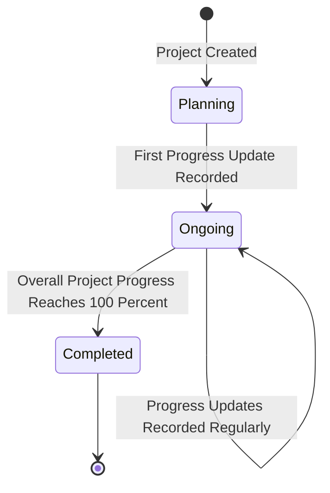

### 21.2 Task Status Transitions

This state diagram shows the valid status transitions for a specific task. A task starts in the On Track state when it is first created. As progress updates are recorded, the system evaluates the task's progress rate against its schedule and expected output. If the progress falls behind the expected rate, the task moves to At Risk. If the task passes its due date or falls significantly behind, it moves to Delayed. If urgent intervention is required, it escalates to Critical. The Labor Productivity Issue state is triggered independently when the actual productivity output is significantly below the computed standard output. Tasks can recover and return to On Track if progress catches up. Any state can transition directly to Completed once the progress reaches 100 percent.

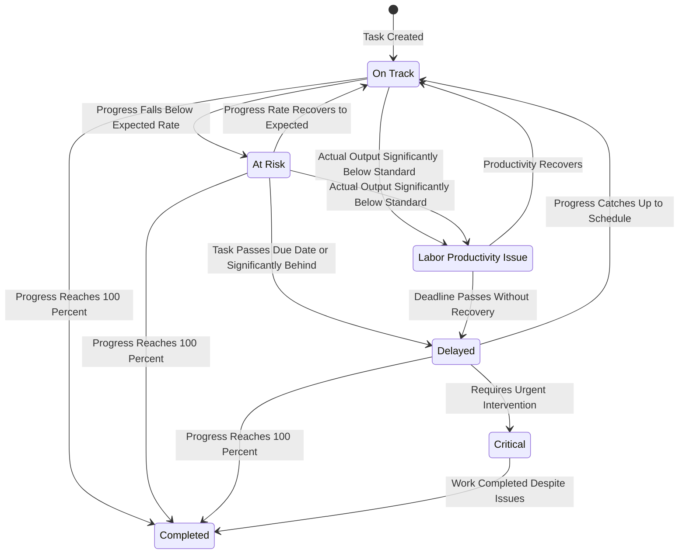

## 22. Sequence Diagram: User Login

This sequence diagram shows the interaction between the user, the web interface, server actions, Supabase authentication, and the database during the login process. It begins with the system checking whether an active session already exists. If no session is found, the login form is shown. After the user submits credentials, the server action sends them to Supabase for verification. The diagram shows both possible outcomes: if the credentials are invalid, an error notification is displayed and the user stays on the login page; if the credentials are valid, the user profile is loaded from the database and the user is redirected to the dashboard.

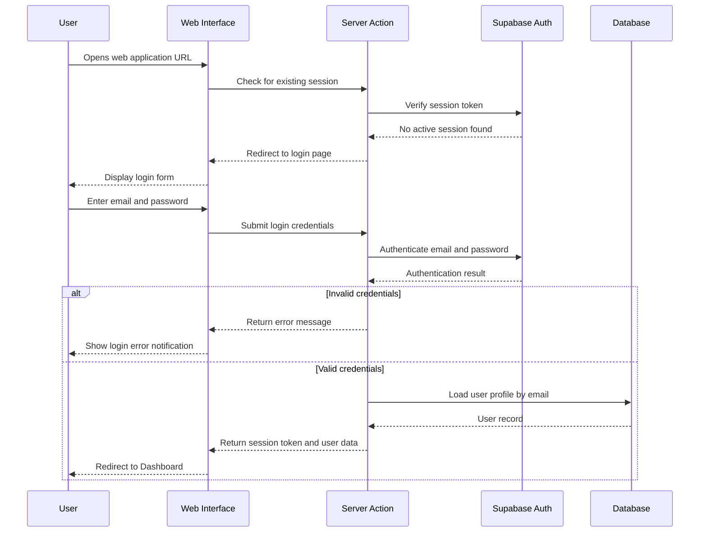

## 23. Sequence Diagram: Creating a Progress Update

This sequence diagram shows the detailed interaction between system components when a user submits a progress update. It traces the flow from the moment the user submits the form, through server-side validation, saving the progress update record, updating the task's completed area and progress percentage, classifying the new task status, and rolling up the computed values to the task head and project level. All database writes happen within the business logic layer before the interface is refreshed and a success notification is shown to the user.

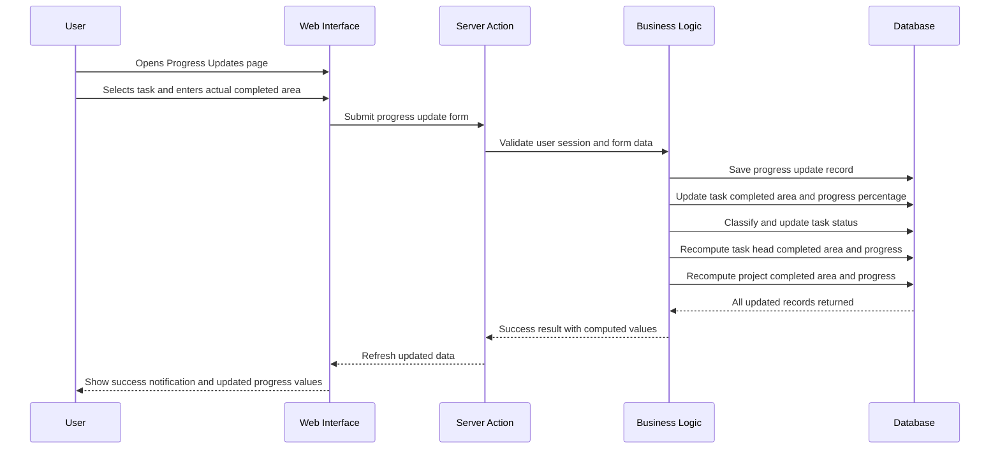

## 24. Sequence Diagram: Creating a Task

This sequence diagram shows the full interaction when a user creates a new specific task under a task head. It includes the user filling out the task form with target area, schedule dates, worker counts, and productivity values. The server action validates the input, checks whether a productivity standard reference is available, computes the standard output from the entered productivity values, and saves the new task record. After saving, the system updates the task head's total target area and the project's total target area to reflect the newly added task. The user sees the new task card with the computed standard output displayed.

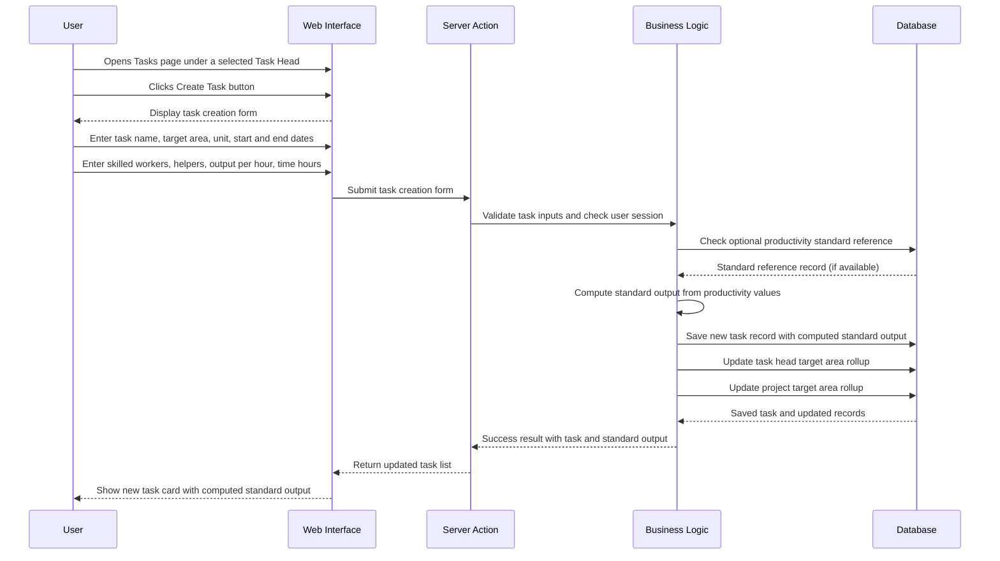

## 25. Sequence Diagram: Deleting a Project

This sequence diagram shows the step-by-step interaction between the user and the system when a project is deleted. The diagram emphasizes the two safety checks that occur before any data is removed: the user's session must be valid, and the project must belong to the current user. If either check fails, the deletion stops. If both pass, the system removes all related records in the correct dependency order — progress updates first, then tasks, task heads, and reports — before deleting the project record itself. The user is then redirected to the project list with a success notification.

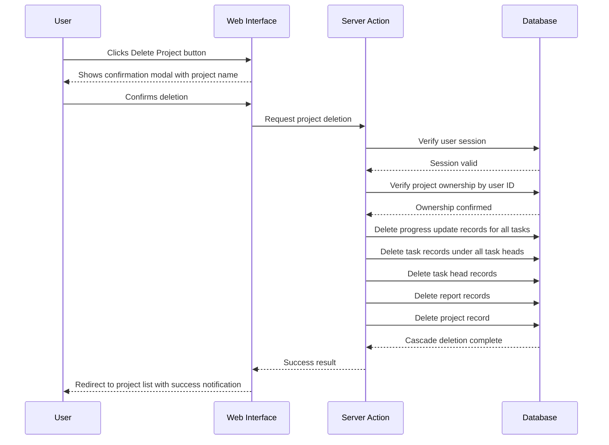

## 26. Navigation Structure

### Navigation Map Diagram

This diagram shows how the pages of the system are connected to each other. The Login page is the entry point and leads directly to the Dashboard after successful authentication. The Dashboard acts as the central hub from which all major sections — Projects, Progress Updates, Calendar, Reports, and Settings — can be accessed. The Project Details page serves as a secondary hub for managing task heads, viewing all tasks, and editing the project. Task creation and editing are only accessible from within the task list under a specific project.

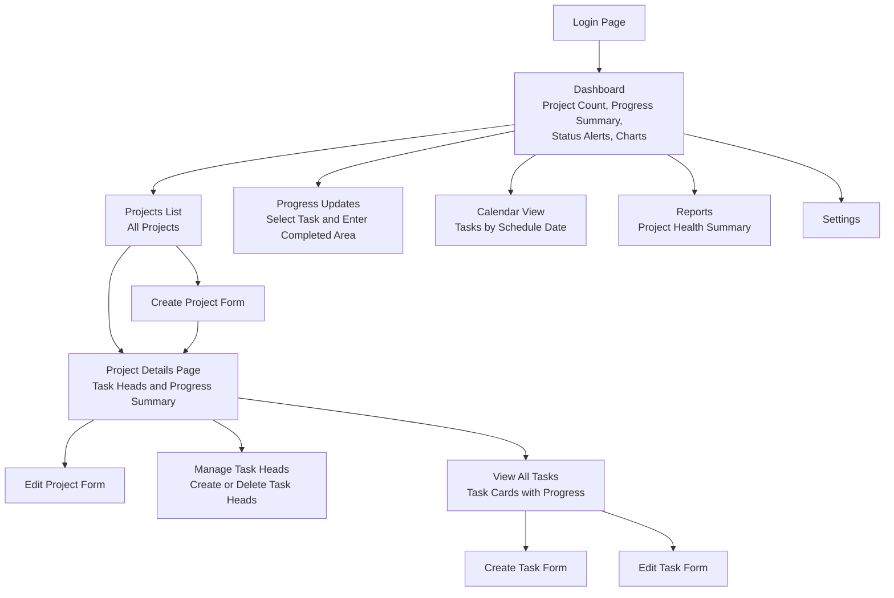

### Navigation Text List

```text
Login
Dashboard
Projects
  Create Project
  Project Details
    Edit Project
    Manage Task Heads
    View All Tasks
      Create Task
      Edit Task
Progress Updates
Calendar
Reports
Settings
```

## 27. User Workflow

The recommended workflow is:

1. User logs in.
2. User creates a project.
3. User opens the project details page.
4. User creates task heads.
5. User creates specific tasks under task heads.
6. User records weekly or monthly progress updates.
7. System computes progress and productivity output.
8. User reviews the dashboard.
9. User checks calendar schedule.
10. User reviews reports for project health.

## 28. Security Design

The system includes the following security controls:

- Login is required before accessing app pages.
- User session is checked before protected operations.
- Project access is validated before update or deletion.
- Each user can only access projects created under their own account.
- Server-side validation is performed before database changes.
- Delete actions require confirmation before execution.

## 29. Validation Design

The system validates form inputs to reduce incorrect data entry.

Examples:

- Project name is required.
- Location is required.
- Target area must be valid.
- Dates must be valid.
- Task head must be selected before creating a task.
- Actual completed area must be entered for progress updates.
- Status values must match accepted status options.

## 30. Testing Plan

### Functional Testing

| Test Case | Expected Result |
| --- | --- |
| Login with valid credentials | User enters dashboard |
| Login with invalid credentials | Error message is displayed |
| Create project | Project appears in project list |
| Edit project | Project details are updated |
| Delete project | Project and related records are removed |
| Create task head | Task head appears under project |
| Delete task head | Task head and related tasks are removed |
| Create task | Task appears under selected task head |
| Edit task | Task details and computations update |
| Delete task | Task and progress updates are removed |
| Add progress update | Progress percentage updates automatically |
| Open calendar | Task schedules are displayed |
| Open reports | Project summaries are displayed |

### Computation Testing

| Test Case | Expected Result |
| --- | --- |
| Actual completed area is 125 and target area is 250 | Progress is 50% |
| Completed area is greater than target area | Progress is capped at 100% |
| Target area is 0 | Progress is 0% |
| Output per hour is 0.5, time is 8, skilled worker is 1 | Daily skilled output is 4 sq.m |
| Daily skilled output is 4 and helpers are 2 | Daily labor output is 2 sq.m |
| Weekly output with 5 working days | Daily output multiplied by 5 |
| Monthly output with 4 weeks per month | Weekly output multiplied by 4 |

### Usability Testing

The system should be tested by non-technical users such as site engineers or supervisors to confirm that:

- The navigation is understandable.
- Project creation is easy to follow.
- Task and progress update forms are clear.
- Dashboard values are easy to interpret.
- Delete confirmation prevents accidental deletion.

## 31. Deployment Design

This diagram shows the deployment architecture of the system from development to production. Code is written on the developer's workstation and pushed to a Git repository. A hosting provider such as Vercel automatically detects the new code and deploys the Next.js application. The deployed application communicates with the PostgreSQL database through Prisma ORM for all data read and write operations, and with Supabase for user login and session management. End users access the system through a standard web browser over a secure HTTPS connection. Environment variables are stored securely on the hosting provider and are never exposed to the client.

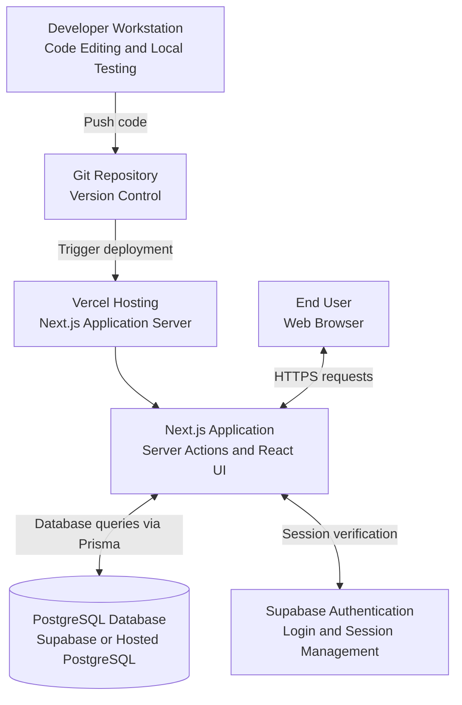

Recommended deployment environment:

- Hosting: Vercel
- Database: Supabase PostgreSQL or hosted PostgreSQL
- Authentication: Supabase Auth
- Environment variables: stored securely in hosting provider settings

## 32. File and Module Structure

Important project folders:

| Path | Purpose |
| --- | --- |
| `src/app` | Main application routes and pages |
| `src/components` | Reusable UI and feature components |
| `src/lib/actions.ts` | Server actions for create, update, delete, and progress updates |
| `src/lib/computations` | Progress, productivity, and status logic |
| `src/lib/data` | Database data mapping and dataset building |
| `src/lib/supabase` | Supabase client and server helpers |
| `src/lib/validations` | Form validation schemas |
| `prisma/schema.prisma` | Database schema |
| `CLIENT-USER-GUIDE.md` | Non-technical user guide |

## 33. Maintenance and Future Enhancements

Future improvements may include:

- PDF report export
- Photo documentation per progress update
- Worker attendance monitoring
- Cost and material tracking
- Role-based permissions for admin, supervisor, and viewer users
- Audit logs for record changes
- Email notifications for delayed or critical tasks
- Mobile-first offline mode for site use
- Forecasting based on productivity trends
- Import and export of Excel project data

## 34. Conclusion

The Web-Based Labor Productivity and Construction Progress Monitoring System provides a practical digital solution for construction progress tracking. It supports project creation, work breakdown through task heads and specific tasks, progress update recording, automatic progress computation, productivity output calculation, schedule monitoring, and reporting.

For a capstone project, the system demonstrates the use of modern web development tools, database design, authentication, CRUD operations, business rule implementation, and visual reporting. It addresses a real construction monitoring problem by helping users identify progress status, productivity concerns, and project health in a centralized application.
